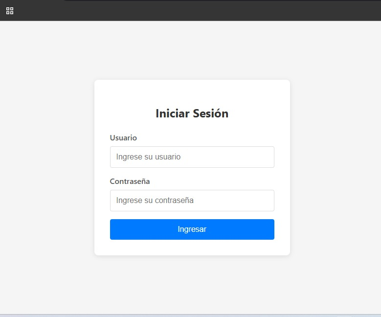
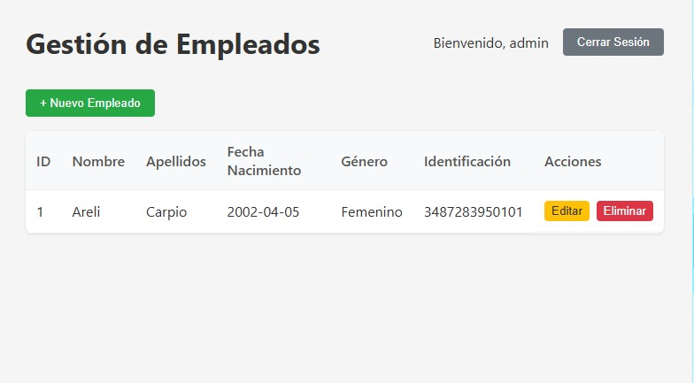
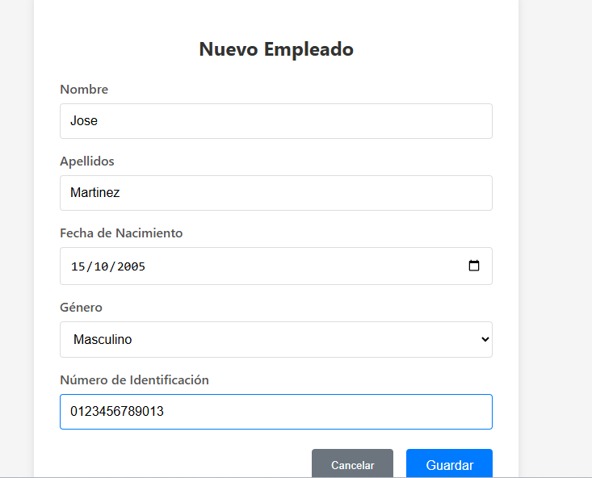
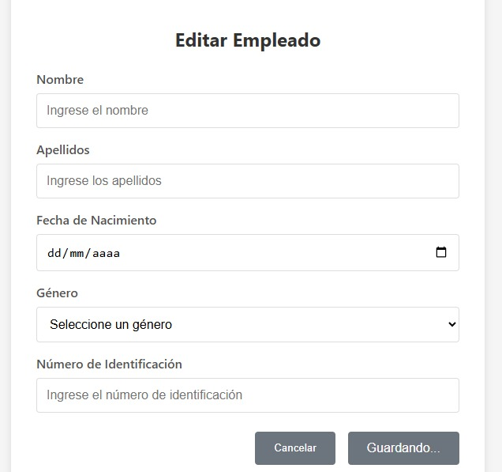
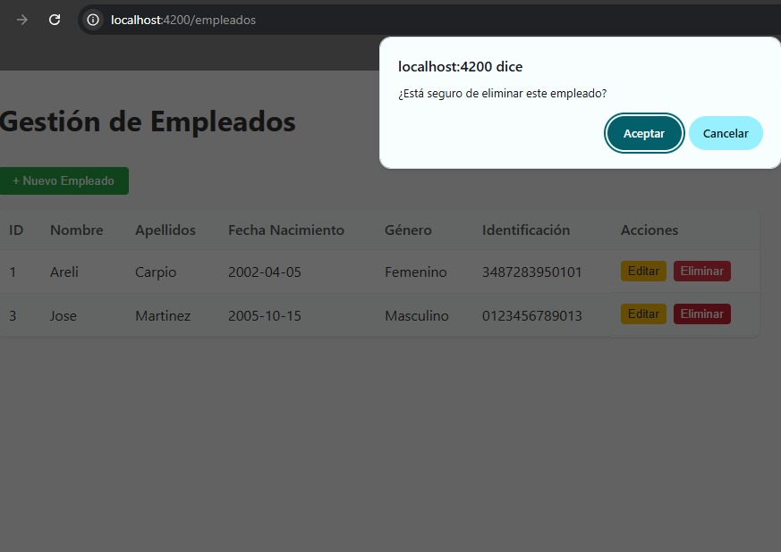
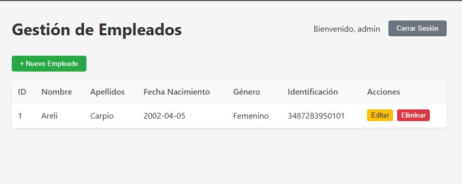

# Prueba Técnica - API REST con Spring Boot y Angular

## Parte Teórica

1. **¿Qué es un API REST y cómo se diferencia de SOAP?**\
   Un API REST es una interfaz de programación de aplicaciones basadas en el protocolo HTTP. La diferencia es que REST es un estilo arquetectónico más flexible y principalmente usa JSON. SOAP es un protocolo estricto basado exclusivamente en XML, que requiere mas ancho de banda pero ofrece mayor seguridad integrada.

2. **¿Qué son y para qué son útiles los hilo? De un ejemplo**\
   Un hilo es la unidad mas pequeña de ejecucuión dentri de un proceso en un sistema operativo, este permite la ejecucuión concurrente de múltiples tareas oara bo bloquear la aplicación principal.
   - Ejemplo: En un procesador de texto, un hilo se encarga de detectar lo que se teclea en tiempo real, mientras que otro hilo en segundo plano revisa la ortografia.

3. **¿Qué estructuras de datos se pueden utilizar para almacenar y manipular colecciones de elementos en Java?**\
   En Java se utiliza el Java Collections Frameworks y las principales interfaces con implementaciones son:
   - List: Permite elementos duplicados y ordenados.
   - Set: No admiten elementos duplicados.
   - Map: Almacena pares clave-valor.
   - Colas: Diseñadas para procesar elementos en un orden especifico.

4. **¿Para manejo de base de datos qué herramienta se puede utilizar en Spring Boot?**\
   Se utiliza principalmente _Spring Data JPA_, que permite trabajar con bases de datos mediante entidades y repositorios sin necesidad de escribir SQL manual. Usualmente funciona sobre Hibernete como motor de ORM.

5. **¿En qué se basa la autenticación po JWT y en qué sse diferencia de la autenticación básica?**\
   La autenticación por JWT se basa en un token firmado que el servidor entrega al usuario tras iniciar sesión. El cliente envia ese token en cada peticion y el servidor lo valida sin guardar estado. En el caso de la autenticación básica envia el usuario y la contraseña codificados en _Base64_ en cada solicitud, lo cual es menos seguro y requiere reenviar las credenciales constantemente.

6. **De forma general ¿Qué es y parea qué sirven los pipelines en CI/CD?**\
   Es una serie de pasos automatizados que sigue el codigo desde que se sube al repositorio hasta que se despliega. Sirve para automatizar el build, las pruebas y el despliegue, garantizando entregas mas rapidas, seguras y con menos errores.

---

## Parte Práctica

### Stack Tecnológico

#### Base de datos

```bash
docker run -e "ACCEPT_EULA=Y" -e "SA_PASSWORD=SqlServer2026*" -p 1433:1433 --name sqlserver -d mcr.microsoft.com/mssql/server:2022-latest
```

#### Backend
- **Java 21**
- **Spring Boot 3.4.4**
- **Spring Security** con autenticación JWT
- **Spring Data JPA** + SQL Server (Docker)

- **JUnit 5** + **Mockito** (pruebas)
- **Maven**

#### Frontend
- **Angular 21**
- **HTTPClient**, **FormsModule**, **RouterModule**

### Estructura del Proyecto

```
prueba-tecnica/
├── backend/
│   ├── pom.xml
│   └── src/main/java/com/prueba/backend/
│       ├── BackendApplication.java
│       ├── config/        # JWT, Security, DataInitializer
│       ├── controller/    # AuthController, EmployeeController
│       ├── dto/           # LoginRequest/Response, EmployeeRequest/Response, ErrorResponse
│       ├── entity/        # UserEntity, Employee
│       ├── exception/     # Personalizadas + GlobalExceptionHandler
│       ├── repository/    # UserRepository, EmployeeRepository
│       └── service/       # AuthService, EmployeeService
├── frontend/
│   └── src/app/
│       ├── components/login/       # Pantalla de inicio de sesión
│       ├── components/employees/   # Listado de empleados
│       ├── components/employee-form/ # Formulario crear/editar
│       └── services/               # Auth, Employee, Interceptor
├── database/
│   └── init.sql          # Script SQL Server
└── README.md
```

### Endpoints de la API

| Método | URL | Descripción | Auth |
|--------|-----|-------------|------|
| POST | `/api/auth/login` | Iniciar sesión | No |
| POST | `/api/auth/logout` | Cerrar sesión | No |
| GET | `/api/empleados` | Listar empleados | JWT |
| GET | `/api/empleados/{id}` | Obtener empleado por ID | JWT |
| POST | `/api/empleados` | Crear empleado | JWT |
| PUT | `/api/empleados/{id}` | Actualizar empleado | JWT |
| DELETE | `/api/empleados/{id}` | Eliminar empleado | JWT |

### Usuario por defecto
- **Username:** admin
- **Password:** admin

### Instrucciones para ejecución

#### Requisitos previos
- Java 21+
- Maven 3.9+
- Node.js 18+
- npm 9+

#### Backend
```bash
cd backend
mvn clean install
mvn spring-boot:run
```
La API estará disponible en: `http://localhost:8080`

#### Frontend
```bash
cd frontend
npm install
npm run start
```
La aplicación estará disponible en: `http://localhost:4200`

> El proxy de Angular redirige `/api/*` al backend (`localhost:8080`) para evitar CORS.

#### Base de datos (SQL Server en Docker)

1. Iniciar el contenedor:
```bash
docker run -e "ACCEPT_EULA=Y" -e "SA_PASSWORD=SqlServer2026*" -p 1433:1433 --name sqlserver -d mcr.microsoft.com/mssql/server:2022-latest
```

2. Crear la base de datos:
```bash
docker exec -i sqlserver /opt/mssql-tools18/bin/sqlcmd -S localhost -U sa -P "SqlServer2026*" -C < database/init.sql
```

3. Si ya existe el contenedor pero está detenido:
```bash
docker start sqlserver
```

El `application.properties` ya está configurado con las credenciales.
Spring Boot creará las tablas automáticamente (`ddl-auto=update`).

#### Ejecutar pruebas
```bash
cd backend
mvn test
```
## Manual de usuario

### 01 - Inicio de Sesión


### 02 - Listado de Empleados


### 03 - Crear Empleado


### 04 - Editar Empleado


### 05 - Eliminar Empleado


### 06 - Listado Final después de Eliminar
